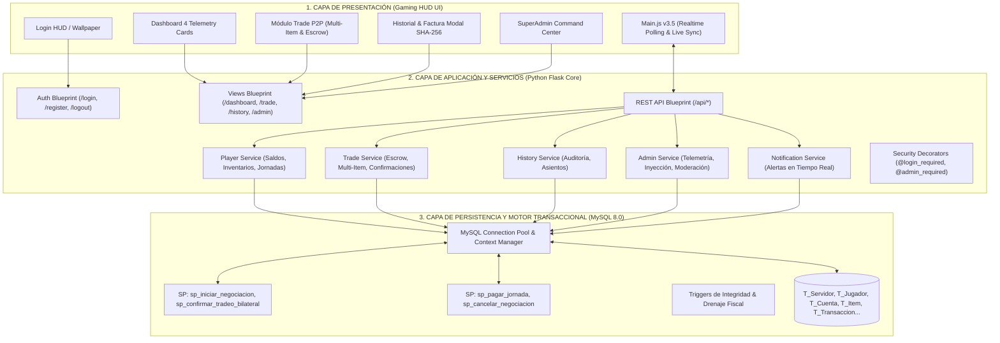
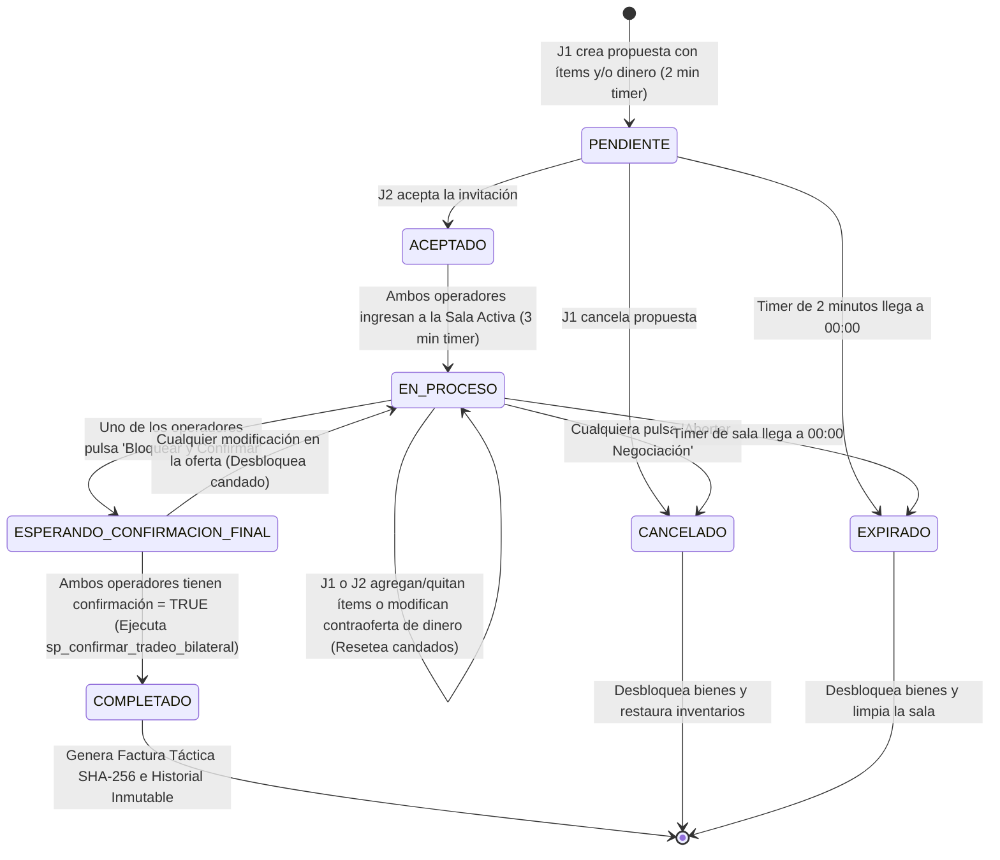

# DOCUMENTO TÉCNICO DE ARQUITECTURA Y FUNCIONAMIENTO INTEGRAL
## SISTEMA DE ECONOMÍA ROLEPLAY & TRADE OS GAMING HUD
**Versión:** 3.5.0 Enterprise // Producción Certificada  
**Institución:** Institución Universitaria Pascual Bravo  
**Asignaturas:** Ingeniería de Software I / Bases de Datos I  
**Equipo Desarrollador:** Grupo 4  
**Fecha de Publicación:** 29 de Septiembre de 2026  

---

## 1. RESUMEN EJECUTIVO Y OBJETIVOS DEL SISTEMA

El sistema **Trade OS Gaming HUD** es una plataforma web y transaccional de alto rendimiento diseñada para emular y gestionar la economía de un servidor de Roleplay (RP). El sistema resuelve los problemas críticos presentes en entornos multijugador masivos:

1. **Prevención de Fraude y Duplicación de Ítems (*Item Duplication & Anti-Cheat*):** Mediante transacciones ACID atómicas en base de datos MySQL con nivel de aislamiento serializable y bloqueos pesimistas (`SELECT ... FOR UPDATE`), garantizando que ningún ítem pueda existir en dos inventarios simultáneamente.
2. **Inmutabilidad Contable por Partida Doble:** Todo movimiento de dinero genera un registro de balance simétrico (Débito y Crédito) en el libro mayor (`T_Detalle_Transaccion`), manteniendo el principio de conservación de la riqueza monetaria en el servidor.
3. **Mecanismo Anti-Inflacionario por Drenaje Fiscal:** Aplicación de un porcentaje de comisión configurable (`T_Servidor.porcentaje_comision`, por defecto 5.0%) que se descuenta de cada transferencia de efectivo y se transfiere automáticamente a la cuenta central de Tesorería del Sistema (`T_Cuenta` ID 1), destruyendo liquidez en exceso o reinyectándola de forma controlada.
4. **Experiencia de Usuario Inmersiva (Cyberpunk Gaming HUD):** Interfaz táctica interactiva v3.0 con soporte para dock sidebar colapsable, marcos con rareza cromática (Común, Raro, Épico, Legendario), temporizadores de cuenta regresiva en vivo, facturación táctica P2P con sellos criptográficos SHA-256 y sincronización en tiempo real sin recarga de página.
5. **Gobernanza y Consola SuperAdmin:** Un centro de mando integral que otorga al SuperAdministrador (`Cardona222`) facultades completas de telemetría financiera en tiempo real, moderación judicial (baneo/rehabilitación), ajuste directo de fondos bancarios, decomiso e inyección de bienes con gravamen/deuda, y parametrización dinámica del kernel.

---

## 2. ARQUITECTURA DE SOFTWARE (3-TIER LAYERED ARCHITECTURE)

El sistema sigue una estricta separación de responsabilidades en tres capas desacopladas:



---

## 3. MODELO DE DATOS Y DICCIONARIO DE BASE DE DATOS

La base de datos relacional `economy_rp` implementa las siguientes 10 entidades normalizadas con integridad referencial estricta:

### 3.1. `T_Servidor`
Almacena los parámetros económicos y de gobernanza global del servidor.
* `id_servidor (INT, PK, AUTO_INCREMENT)`: Identificador único del servidor.
* `nombre (VARCHAR(100), NOT NULL)`: Nombre institucional del servidor (ej. *Servidor Principal RP Los Santos*).
* `porcentaje_comision (DECIMAL(5,2), NOT NULL)`: Tasa de drenaje del sistema (por defecto `5.00`%).
* `limite_bienes_por_jugador (INT, NOT NULL)`: Capacidad máxima de slots de inventario por operador (`RN007`, por defecto `100`).
* `tiempo_enfriamiento_min (INT, NOT NULL)`: Intervalo obligatorio de descanso entre jornadas laborales (`RN008`, por defecto `15` min).

### 3.2. `T_Jugador`
Almacena las cuentas de usuario y credenciales de los operadores del juego.
* `id_jugador (INT, PK, AUTO_INCREMENT)`: Identificador único del operador.
* `id_servidor (INT, FK -> T_Servidor)`: Servidor asignado.
* `nombre_usuario (VARCHAR(50), UNIQUE, NOT NULL)`: Tag de acceso único del jugador.
* `correo (VARCHAR(150), UNIQUE, NOT NULL)`: Dirección de correo electrónico verificada.
* `contrasena_hash (VARCHAR(255), NOT NULL)`: Hash de seguridad Bcrypt con salting criptográfico.
* `fecha_registro (DATETIME, DEFAULT CURRENT_TIMESTAMP)`: Fecha y hora de alta en el sistema.
* `estado (VARCHAR(20), CHECK in ('ACTIVO', 'BANCARROTA', 'SUSPENDIDO'))`: Estado legal del jugador (`RN005`).
* `es_admin (BOOLEAN, NOT NULL DEFAULT FALSE)`: Bandera de privilegios SuperAdministrador (`Cardona222` = TRUE).

### 3.3. `T_Cuenta`
Registra las cuentas bancarias de partida doble (Cuentas Personales y Cuenta de Tesorería del Sistema).
* `id_cuenta (INT, PK, AUTO_INCREMENT)`: Identificador de la cuenta contable.
* `id_jugador (INT, FK -> T_Jugador, NULLABLE)`: Operador titular (NULL para la cuenta del sistema).
* `id_servidor (INT, FK -> T_Servidor)`: Servidor emisor.
* `tipo_cuenta (VARCHAR(20), CHECK in ('PERSONAL', 'SISTEMA'))`: Clasificación contable (`RN006`).
* `saldo_inicial (DECIMAL(12,2), NOT NULL)`: Fondos con los que inició el registro contable.
* `saldo_disponible (DECIMAL(12,2), NOT NULL, CHECK >= 0)`: Liquidez bancaria inmediata disponible (`RN002`).

### 3.4. `T_Item`
Catálogo de activos y bienes físicos tangibles en posesión de los jugadores.
* `id_item (INT, PK, AUTO_INCREMENT)`: Identificador único del bien.
* `id_jugador (INT, FK -> T_Jugador)`: Propietario actual del ítem (`RN003`).
* `nombre (VARCHAR(100), NOT NULL)`: Nombre o denominación comercial del activo.
* `precio (DECIMAL(12,2), NOT NULL, CHECK > 0)`: Valor comercial tasado.
* `fecha (DATETIME, DEFAULT CURRENT_TIMESTAMP)`: Fecha de adquisición o inyección.
* `tiene_deuda (BOOLEAN, NOT NULL DEFAULT FALSE)`: Indicador de gravamen, prenda o embargo (`RN004`).
* `antiguedad_dias (INT, DEFAULT 0)`: Tiempo de posesión del activo.

### 3.5. `T_Negociacion_Tradeo`
Controla el estado y ciclo de vida de una sesión de intercambio bilateral P2P.
* `id_negociacion (INT, PK, AUTO_INCREMENT)`: Identificador de la sala de negociación.
* `id_jugador_1 (INT, FK -> T_Jugador)`: Operador iniciador de la propuesta.
* `id_jugador_2 (INT, FK -> T_Jugador)`: Operador destinatario de la propuesta.
* `id_item_j1 (INT, FK -> T_Item, NULLABLE)`: Ítem singular principal de J1 (retrocompatibilidad).
* `id_item_j2 (INT, FK -> T_Item, NULLABLE)`: Ítem singular principal de J2 (retrocompatibilidad).
* `items_j1_ids (VARCHAR(255), NULLABLE)`: Lista serializada de IDs de bienes ofrecidos por J1.
* `items_j2_ids (VARCHAR(255), NULLABLE)`: Lista serializada de IDs de bienes ofrecidos por J2.
* `monto_j1 (DECIMAL(12,2), DEFAULT 0.00)`: Efectivo adjunto por J1.
* `monto_j2 (DECIMAL(12,2), DEFAULT 0.00)`: Efectivo adjunto por J2.
* `confirmacion_j1 (BOOLEAN, DEFAULT FALSE)`: Candado de aceptación final de J1 (`RN010`).
* `confirmacion_j2 (BOOLEAN, DEFAULT FALSE)`: Candado de aceptación final de J2 (`RN010`).
* `estado (VARCHAR(50), CHECK in ('PENDIENTE','ACEPTADO','EN_PROCESO','ESPERANDO_CONFIRMACION_FINAL','COMPLETADO','CANCELADO','EXPIRADO'))`: Máquina de estados de la sala (`RN009`).
* `fecha_creacion (DATETIME, DEFAULT CURRENT_TIMESTAMP)`: Apertura de la sesión.
* `fecha_expiracion (DATETIME, NOT NULL)`: Límite de tiempo antes de anulación por inactividad.

### 3.6. `T_Transaccion`
Encabezado inmutable del libro diario contable.
* `id_transaccion (INT, PK, AUTO_INCREMENT)`: Número correlativo único de transacción.
* `id_item_afectado (INT, FK -> T_Item, NULLABLE)`: Bien principal transferido.
* `id_negociacion (INT, FK -> T_Negociacion_Tradeo, NULLABLE)`: Sala de origen si fue tradeo.
* `id_jornada (INT, FK -> T_Jornada_Laboral, NULLABLE)`: Jornada si fue salario.
* `tipo_transaccion (VARCHAR(30), CHECK in ('PAGO_SALARIO', 'TRADEO_P2P', 'COMPRA_COMERCIANTE'))`: Naturaleza de la operación (`RN012`).
* `estado_transaccion (VARCHAR(20), DEFAULT 'COMPLETADA', CHECK in ('COMPLETADA','CANCELADA','REVERTIDA'))`: Estado de auditoría.
* `monto (DECIMAL(12,2), NOT NULL)`: Monto total nominal de la operación.
* `fecha_hora (DATETIME, DEFAULT CURRENT_TIMESTAMP)`: Sello temporal inmutable.

### 3.7. `T_Detalle_Transaccion`
Líneas de asiento contable de partida doble.
* `id_detalle (INT, PK, AUTO_INCREMENT)`: Identificador de la línea de asiento.
* `id_transaccion (INT, FK -> T_Transaccion)`: Transacción padre vinculada.
* `cuenta_origen (INT, FK -> T_Cuenta)`: Cuenta que entrega fondos o contraparte.
* `cuenta_destino (INT, FK -> T_Cuenta)`: Cuenta que recibe fondos o contraparte.
* `tipo_movimiento (VARCHAR(10), CHECK in ('DEBITO', 'CREDITO'))`: Naturaleza del apunte contable (`RN001`).
* `monto_detalle (DECIMAL(12,2), NOT NULL)`: Cuantía monetaria exacta del asiento.
* `concepto (VARCHAR(80))`: Glosa explicativa (ej. `COMISION_DRENAJE_SISTEMA (5%)`).

### 3.8. `T_Notificacion`
Cola de eventos y notificaciones push en tiempo real para clientes HUD.
* `id_notificacion (INT, PK, AUTO_INCREMENT)`: Identificador del mensaje.
* `id_jugador (INT, FK -> T_Jugador ON DELETE CASCADE)`: Destinatario de la alerta.
* `titulo (VARCHAR(100), NOT NULL)`: Encabezado táctico de la notificación.
* `mensaje (TEXT, NOT NULL)`: Cuerpo descriptivo de la acción ejecutada.
* `tipo (VARCHAR(20), DEFAULT 'ADMIN')`: Nivel de severidad (`SUCCESS`, `WARNING`, `ERROR`, `ADMIN`, `INFO`).
* `leido (BOOLEAN, DEFAULT FALSE)`: Bandera de confirmación de lectura.
* `fecha_creacion (DATETIME, DEFAULT CURRENT_TIMESTAMP)`: Sello temporal de emisión.

---

## 4. MATRIZ DE REGLAS DE NEGOCIO (RN001 - RN014) Y DEMOSTRACIÓN MATEMÁTICA

| Código | Denominación Oficial | Mecanismo de Implementación | Comportamiento del Kernel |
| :--- | :--- | :--- | :--- |
| **RN001** | Principio de Partida Doble | `T_Detalle_Transaccion` & `sp_confirmar_tradeo_bilateral` | $\sum \text{Débitos} = \sum \text{Créditos}$. Cada movimiento financiero registra asientos simétricos. |
| **RN002** | No Negatividad de Fondos | Constraint `CHECK (saldo_disponible >= 0)` | Ninguna cuenta puede tener saldo menor a $0.00. La transacción aborta si no hay liquidez suficiente. |
| **RN003** | Propiedad Exclusiva de Bienes | `T_Item.id_jugador` & Clave Foránea | Un bien solo puede pertenecer a un único jugador a la vez. No existe la copropiedad simultánea. |
| **RN004** | Restricción por Deuda / Embargo | `T_Item.tiene_deuda == FALSE` | Si un ítem registra gravamen o deuda pendiente, el kernel rechaza su inclusión en cualquier tradeo P2P. |
| **RN005** | Restricción por Quiebra / Suspensión | `T_Jugador.estado == 'ACTIVO'` | Los jugadores en estado `BANCARROTA` o `SUSPENDIDO` tienen bloqueado el acceso y las transferencias. |
| **RN006** | Separación Cuentas Personales vs Sistema | `T_Cuenta.tipo_cuenta` & Clave Única Generada | Las cuentas `PERSONAL` están asociadas a jugadores. La cuenta `SISTEMA` es única y custodia la Tesorería. |
| **RN007** | Límite Máximo de Capacidad de Bienes | `COUNT(T_Item) <= limite_bienes_por_jugador` | Si la recepción de ítems excede los 100 slots permitidos, la transferencia se deniega por aforo. |
| **RN008** | Enfriamiento Laboral (*Cooldown*) | `T_Servidor.tiempo_enfriamiento_min` (15 min) | `sp_pagar_jornada` verifica la última jornada del mismo empleo. Si $\Delta t < 15$ min, arroja Error 45000. |
| **RN009** | Máquina de Estados de Negociación | `T_Negociacion_Tradeo.estado` | Flujo secuencial: `PENDIENTE` $\rightarrow$ `ACEPTADO` $\rightarrow$ `EN_PROCESO` $\rightarrow$ `ESPERANDO_CONFIRMACION_FINAL` $\rightarrow$ `COMPLETADO`. |
| **RN010** | Reinicio de Candados por Modificación | Trigger / `actualizar_oferta_jugador` | Cualquier cambio en ítems o dinero resetea `confirmacion_j1 = FALSE` y `confirmacion_j2 = FALSE`. |
| **RN011** | Límite Diario de 5 Tradeos P2P | Consulta de control en `trade_service` | Máximo 5 operaciones completadas por jugador en el día calendario para evitar lavado de activos. |
| **RN012** | Auditoría Completa de Transacciones | `T_Transaccion` + `T_Detalle_Transaccion` | Toda operación genera número de factura inmutable con fecha, hora, actores y firma digital SHA-256. |
| **RN013** | Inmutabilidad de Asientos Históricos | Sin procedimientos de `UPDATE` ni `DELETE` en historial | Los asientos del libro diario no se modifican ni eliminan bajo ninguna circunstancia. |
| **RN014** | Drenaje Fiscal Anti-Inflacionario | `T_Servidor.porcentaje_comision` (5.0%) | Del efectivo transferido se deduce el 5% ($M \times 0.05$) y se abona a la Tesorería del Sistema. |

### 4.1. Demostración Matemática del Drenaje Fiscal y Conservación de Riqueza

Sean dos operadores $J_1$ y $J_2$ con cuentas personales $C_1$ y $C_2$, y la cuenta de Tesorería del Sistema $S$.  
Si $J_1$ ofrece un monto $M_1 \ge 0$ y $J_2$ ofrece un monto $M_2 \ge 0$, con una tasa de drenaje fiscal $\tau = 0.05$ (5%):

1. **Comisiones Liquidadas:**
   $$\text{Comisión}_1 = M_1 \times \tau, \quad \text{Monto Neto Recibido por } J_2 = M_1 \times (1 - \tau)$$
   $$\text{Comisión}_2 = M_2 \times \tau, \quad \text{Monto Neto Recibido por } J_1 = M_2 \times (1 - \tau)$$
   $$\text{Drenaje Total Absorbido por Tesorería } (\Delta S) = \text{Comisión}_1 + \text{Comisión}_2$$

2. **Variación Neta de Saldos:**
   $$\Delta C_1 = -M_1 + M_2(1 - \tau)$$
   $$\Delta C_2 = -M_2 + M_1(1 - \tau)$$
   $$\Delta S = \tau (M_1 + M_2)$$

3. **Demostración de Conservación de Masa Monetaria Global:**
   $$\Delta C_1 + \Delta C_2 + \Delta S = \left[-M_1 + M_2 - \tau M_2\right] + \left[-M_2 + M_1 - \tau M_1\right] + \left[\tau M_1 + \tau M_2\right] = 0$$
   $$\therefore \sum \text{Saldos Finales} = \sum \text{Saldos Iniciales} \quad \text{(Q.E.D.)}$$

---

## 5. CICLO DE VIDA DE UNA NEGOCIACIÓN BILATERAL (TRADE ENGINE)



---

## 6. SISTEMA DE NOTIFICACIONES Y SINCRONIZACIÓN EN TIEMPO REAL

Para ofrecer una experiencia fluida sin parpadeos ni recargas de página, el cliente implementa un motor reactivo de escucha bidireccional:

1. **Ciclo de Polling Eficiente (`checkRealtimeNotifications`):**
   - Se ejecuta cada **1,500 ms** consultando el endpoint `/api/notifications/unread`.
   - Cuando el SuperAdministrador (`Cardona222`) inyecta un bien, quita fondos, decomisa un ítem o altera permisos desde el panel `/admin`, el backend inserta un registro en `T_Notificacion`.
2. **Despliegue Visual Táctico (*SweetAlert2 HUD*):**
   - El cliente intercepta la notificación no leída y despliega un modal con borde neón brillante, icono de severidad y texto descriptivo de la acción ejecutada por el Administrador.
3. **Actualización Automática Reactiva (`triggerLiveViewUpdates`):**
   - Al recibir la notificación, el script dispara la actualización de las vistas activas:
     - **Dashboard:** Ejecuta `updateDashboard()`, recalculando saldo, patrimonio total, slots y telemetría.
     - **Trade:** Ejecuta `refreshTradeInventory()`, refrescando los checkboxes de ítems seleccionables.
     - **Historial:** Ejecuta `updateHistory()`, incorporando nuevos movimientos.
     - **Admin:** Ejecuta `refreshAdminData()`, actualizando telemetría y tablas.
   - Envía `/api/notifications/mark-read` para archivar los eventos procesados.

---

## 7. REFERENCIA COMPLETA DE ENDPOINTS REST API

### 7.1. Autenticación y Sesión
* `POST /login`: Inicio de sesión (parámetros form-urlencoded `usuario`, `password`). Valida hash Bcrypt y estado `ACTIVO`.
* `POST /register`: Registro de nuevo operador (`usuario`, `correo`, `password`).
* `GET /logout`: Cierre y purga completa de la sesión activa.

### 7.2. Telemetría y Dashboard
* `GET /api/dashboard`: Retorna `{ success, saldo, patrimonio_total, valor_inventario, total_items, items_libres, items_con_deuda, total_trades, limite_bienes, porcentaje_comision, inventario: [...] }`.
* `GET /api/history`: Retorna el historial de movimientos contables del operador `{ success, historial: [...] }`.

### 7.3. Notificaciones en Tiempo Real
* `GET /api/notifications/unread`: Retorna la lista de notificaciones pendientes del usuario `{ success, notifications: [...] }`.
* `POST /api/notifications/mark-read`: Marca notificaciones como leídas `{ ids: [1, 2, ...] }`.

### 7.4. Módulo de Comercio P2P (Trade Engine)
* `POST /api/trades/open`: Inicia una nueva propuesta `{ destinatario, item_ids: [...], monto_j1, expiracion }`.
* `GET /api/trades/pending`: Consulta invitaciones entrantes pendientes con temporizador `{ success, invitaciones: [...] }`.
* `GET /api/trades/active`: Consulta la mesa activa del jugador `{ success, data: { id_negociacion, ... } }`.
* `GET /api/trades/<id>/status`: Consulta el estado detallado en vivo de una sala activa.
* `POST /api/trades/accept`: Acepta una invitación entrante `{ id_trade }`.
* `POST /api/trades/update`: Actualiza oferta en sala activa `{ id_trade, item_ids: [...], money }`.
* `POST /api/trades/confirm`: Aplica candado de confirmación bilateral `{ id_trade }`.
* `POST /api/trades/cancel`: Cancela o aborta una negociación `{ id_trade }`.

### 7.5. Mando y Control SuperAdmin (`@admin_required`)
* `GET /api/admin/telemetry`: Métricas globales agregadas (Tesorería central, circulante M2, total bienes, operadores, volumen, configuración).
* `GET /api/admin/players`: Lista completa de operadores con roles, saldos e inventarios.
* `POST /api/admin/players/<id>/status`: Baneo / Rehabilitación judicial `{ estado: 'ACTIVO' | 'SUSPENDIDO' | 'BANCARROTA' }`.
* `POST /api/admin/players/<id>/role`: Otorgar o revocar permisos de administrador `{ es_admin: true | false }`.
* `POST /api/admin/players/<id>/money`: Intervención bancaria `{ monto: float, operacion: 'ADD' | 'SUB' | 'SET' }`.
* `POST /api/admin/players/create`: Creación de operadores con saldo asignado `{ usuario, correo, password, saldo_inicial, es_admin }`.
* `GET /api/admin/players/<id>/inventory`: Auditoría detallada del inventario de cualquier jugador.
* `POST /api/admin/items/delete`: Decomiso / Eliminación forzada de un bien `{ id_item }`.
* `POST /api/admin/items/inject`: Inyección de bien personalizado `{ id_jugador, nombre, precio, tiene_deuda }`.
* `POST /api/admin/server/config`: Ajuste de parámetros globales `{ porcentaje_comision, limite_bienes, tiempo_enfriamiento }`.
* `POST /api/admin/treasury/inject`: Inyección de capital a la Tesorería Central `{ monto }`.
* `POST /api/admin/trades/force_clean`: Purga forzada de salas huérfanas o trabadas.

---

## 8. GUÍA DE INSTALACIÓN, DESPLIEGUE Y COMANDOS

### 8.1. Requisitos Previos
* Python 3.10 o superior instalado.
* Servidor MySQL 8.0 corriendo localmente en el puerto 3306.
* Base de datos `economy_rp` creada o con permisos de creación.

### 8.2. Pasos de Despliegue
1. **Instalación de Dependencias Python:**
   ```bash
   pip install flask mysql-connector-python bcrypt reportlab selenium
   ```
2. **Inicialización y Homologación de Base de Datos:**
   ```bash
   py scripts/reseed_clean_rich_inventory.py
   ```
3. **Puesta en Marcha del Servidor Web Flask:**
   ```bash
   py run.py
   ```
4. **Acceso al Sistema:**
   - Abrir el navegador en `http://127.0.0.1:5000`
   - **Credenciales SuperAdministrador:** Operador `Cardona222` / Clave `21492477`
   - **Credenciales Jugador Estándar:** Operador `Cardona` / Clave `21492477`

---
*Fin del Documento Técnico — Trade OS Gaming HUD Architecture v3.5*
