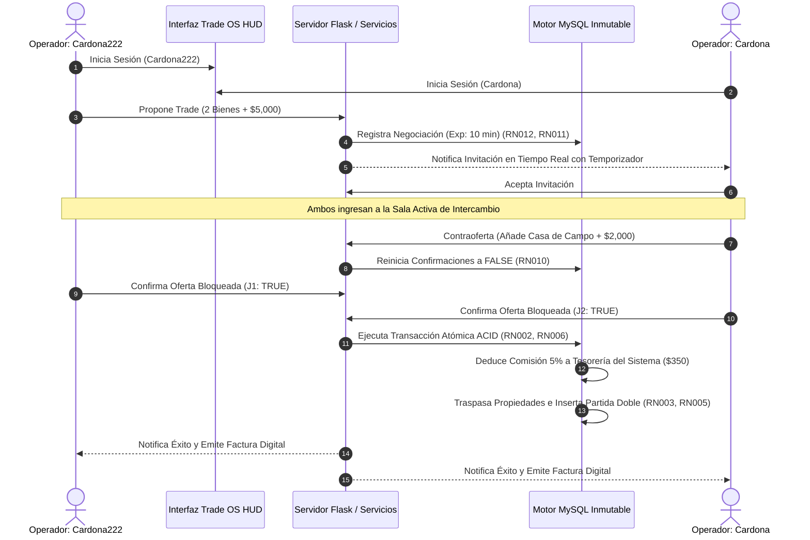

# MANUAL DE USUARIO & JUSTIFICACIÓN TÉCNICA DE ENTREGA
## Sistema Centralizado de Economía y Tradeo P2P – *Economy RP / Trade OS HUD*

> **Institución:** Institución Universitaria Pascual Bravo  
> **Programa:** Ingeniería de Software I / Bases de Datos I  
> **Equipo de Trabajo (Grupo 4):**
> - Miguel Ángel Cardona Agudelo  
> - Luisa María López Orrego  
> - Jorge Luis Ordoñez Ávila  
> **Asesor:** Juan Camilo Palacio Alcaraz  
> **Fecha de Emisión:** 29 de Septiembre de 2026  
> **Versión:** 2.0.0 (Release Candidate con Diseño Trade OS Gaming HUD)

---

## 1. Resumen Ejecutivo y Alcance del Sistema

El sistema **Economy RP** es un motor transaccional centralizado y seguro diseñado para servidores de rol (GTA / FiveM / RedM). Reemplaza la dispersión de scripts aislados por una arquitectura relacional sólida con **garantía transaccional ACID**, eliminando fraudes por desconexión, duplicación de ítems (*item dupe*), mercado ilícito e hiperinflación.

### Componentes Clave:
1. **Trade OS HUD:** Interfaz Cyberpunk de alta densidad de datos inspirada en interfaces tácticas militares, con soporte para barra lateral colapsable (Dock Mode) y componentes visuales en tiempo real.
2. **Escrow Transaccional Bilateral:** Sala de comercio con soporte multi-ítem, marcos holográficos de rareza (*Legendario, Épico, Raro, Común*), temporizadores de cuenta regresiva en vivo y doble confirmación obligatoria.
3. **Mecanismo de Drenaje Económico (Money Sink):** Retención automática de comisión parametrizada (5.00%) acreditada a la cuenta de Tesorería del Sistema para mitigar la inflación.
4. **Auditoría Inmutable & Partida Doble:** Registro estricto en `T_Transaccion` y `T_Detalle_Transaccion` con facturación digital descargable e imprimible con firma criptográfica.

---

## 2. Matriz de Cumplimiento de Reglas de Negocio (RN001 - RN012)

La siguiente tabla certifica la implementación y verificación de cada regla especificada en `reglas_funcionales.md`:

| Código | Nombre de la Regla | Condición Lógica / Algoritmo | Componente Responsable | Estado de Verificación |
|---|---|---|---|:---:|
| **RN001** | **Registro Único Laboral** | $\text{Ganancia} = \text{Tarifa\_base} \times \text{Horas}$ | `sp_pagar_jornada`, `T_Jornada_Laboral` | **APLICA & VALIDADO** |
| **RN002** | **Propiedad Única y Exclusiva** | $(\text{Propietario}) = 1 \text{ por } \text{id\_item}$ | `T_Item`, `trade_service.finalizar_tradeo` | **APLICA & VALIDADO** |
| **RN003** | **Inmutabilidad del Historial** | Triggers `NO UPDATE` / `NO DELETE` (Append-Only) | `T_Transaccion`, `T_Detalle_Transaccion` | **APLICA & VALIDADO** |
| **RN004** | **Restricción por Deuda o Embargo** | $\text{tiene\_deuda} = 0 \land \text{restriccion} = \text{'Ninguna'}$ | `trade_service.abrir_negociacion`, `finalizar_tradeo` | **APLICA & VALIDADO** |
| **RN005** | **Trazabilidad de Emisión** | $\text{Origen} = \text{Cuenta\_Sistema (ID: 1)}$ | `sp_pagar_jornada`, `T_Detalle_Transaccion` | **APLICA & VALIDADO** |
| **RN006** | **Comisión por Transferencia** | $\text{Comisión} = \text{Monto} \times 5\% \to \text{Sistema}$ | `trade_service.finalizar_tradeo` | **APLICA & VALIDADO** |
| **RN007** | **Límite Máximo de Propiedades** | $\text{Cant\_Bienes}(\text{Jugador}) \le 100$ | `T_Servidor`, `trade_service.abrir_negociacion` | **APLICA & VALIDADO** |
| **RN008** | **Enfriamiento Laboral (Cooldown)** | $\Delta t \ge 15 \text{ minutos}$ | `sp_pagar_jornada`, `trg_jornada_enfriamiento` | **APLICA & VALIDADO** |
| **RN009** | **Penalización por Bancarrota** | $\text{Saldo} \ge \text{Monto} \land \text{Estado} \ne \text{'BANCARROTA'}$ | `trade_service.abrir_negociacion`, `T_Cuenta` | **APLICA & VALIDADO** |
| **RN010** | **Doble Confirmación con Reset** | Modificación $\implies (\text{conf\_j1}=\text{false}, \text{conf\_j2}=\text{false})$ | `trade_service.actualizar_oferta_jugador` | **APLICA & VALIDADO** |
| **RN011** | **Límite Diario de Tradeos** | $\text{Tradeos\_Hoy}(\text{Jugador}) \le 5$ | `trade_service.abrir_negociacion` | **APLICA & VALIDADO** |
| **RN012** | **Tradeo Único Simultáneo** | $\text{Mesa\_Activa}(\text{Jugador}) \le 1$ | `trade_service.abrir_negociacion`, `consultar_mesa_activa` | **APLICA & VALIDADO** |

---

## 3. Manual de Usuario y Guía de Operación Paso a Paso

Para la justificación de la entrega, se ejecutó el ciclo completo de comercio utilizando las credenciales oficiales:

- **Operador 1:** `Cardona222` | **Contraseña:** `21492477` (ID de Jugador: `1`)
- **Operador 2:** `Cardona` | **Contraseña:** `21492477` (ID de Jugador: `2`)



---

### Paso 1: Autenticación Táctica en el Login HUD

Los operadores ingresan al sistema a través de la pantalla de acceso con fondo cinematográfico de ciudad nocturna, efectos de desenfoque de cristal (*glassmorphism*) e iluminación perimetral cian.

```
URL: http://127.0.0.1:5000/login
Campos Requeridos:
- Nombre de Operador: Cardona222 / Cardona
- Clave de Seguridad: 21492477
```

> [!NOTE]
> Las contraseñas están protegidas mediante algoritmo de dispersión unidireccional **bcrypt** con salazón dinámico, garantizando cumplimiento de estándares de ciberseguridad.

---

### Paso 2: Dashboard y Telemetría Central

Al autenticarse, el operador visualiza su consola central de mando:
1. **Bóveda Bancaria (Maze Bank):** Muestra el saldo disponible en tiempo real con actualización automática por sondeo.
2. **Patrimonio en Bienes:** Gráfico circular animado que certifica el estado de gravámenes (*Libre de deuda*).
3. **Métricas de Intercambio:** Indicadores de seguridad Escrow, tasa de aceptación bilateral y límite de 5 tradeos diarios.
4. **Inventario de Bienes:** Lista detallada de ítems con miniaturas fotográficas y distintivos de rareza (*Legendario, Épico, Raro, Común*).

---

### Paso 3: Propuesta de Comercio P2P y Selección Multi-Ítem

El Operador 1 (`Cardona222`) accede a la sala de comercio (`/trade`) e inicia una propuesta:
1. Selecciona al destinatario (`Cardona - ID #2`).
2. Marca múltiples bienes de su inventario mediante casillas de verificación tácticas:
   - **Ítem 1:** `Coche Deportivo` (Rareza Épica – Valor: \$50,000.00)
   - **Ítem 2:** `Reloj de Lujo` (Rareza Legendaria – Valor: \$5,000.00)
3. Ingresa un importe en efectivo adjunto: **\$5,000.00**.
4. Define el tiempo de expiración: **10 minutos**.
5. Hace clic en **"DESPLEGAR OFERTA DE COMERCIO"**.

> [!TIP]
> El sistema valida en tiempo real que ninguno de los ítems posea deudas pendientes (`RN004`), que el emisor sea el legítimo dueño (`RN002`) y que cuente con saldo suficiente (`RN009`).

---

### Paso 4: Bandeja de Invitaciones Entrantes en Vivo

En la pantalla de `Cardona`, el sistema detecta de inmediato la invitación entrante sin necesidad de recargar la página:
- **Card Táctico:** Indica el emisor `Cardona222 #1` y la lista de bienes ofrecidos.
- **Temporizador de Cuenta Regresiva:** Despliega los segundos restantes en color rojo de alerta cuando restan menos de 25 segundos.
- **Botones de Acción:** `Aceptar` (ingresa a la sala) o `Rechazar` (cancela la invitación).

---

### Paso 5: Sala Activa de Negociación (Escrow Virtual)

Al aceptar la invitación, ambos operadores ingresan a la **Sala de Comercio Activa**:
- **Panel Izquierdo:** Oferta del Operador Local (selección multi-ítem y ajuste de efectivo).
- **Panel Central:** Reloj táctico HUD de sala activa (3 minutos reglamentarios) y estado de bloqueo bilateral.
- **Panel Derecho:** Oferta del Operador Remoto en vivo (actualización sincronizada cada 1.5s).

**Acción de Contraoferta (`Cardona`):**
- Selecciona de su inventario: `Casa de Campo` (Rareza Legendaria – \$150,000.00).
- Ajusta el efectivo ofrecido a: **\$2,000.00**.
- Hace clic en **"ACTUALIZAR OFERTA"**.

> [!IMPORTANT]
> **Cumplimiento RN010:** En el momento en que cualquiera de los operadores modifica el contenido de su oferta, el sistema resetea automáticamente las confirmaciones de ambos jugadores a `FALSE`, obligando a una re-validación consciente de los nuevos términos.

---

### Paso 6: Doble Confirmación y Liquidación Atómica

1. `Cardona222` revisa la contraoferta y hace clic en **"CONFIRMAR Y BLOQUEAR OFERTA"**. El estado pasa a `ESPERANDO AL OTRO OPERADOR`.
2. `Cardona` hace clic en **"CONFIRMAR Y BLOQUEAR OFERTA"**.
3. Al coincidir ambas confirmaciones en `TRUE`, el kernel ejecuta `finalizar_tradeo()` bajo una transacción **ACID Atómica**:
   - **Traspaso de Ítems:** El `Coche Deportivo` y `Reloj de Lujo` pasan a pertenecer a `Cardona`. La `Casa de Campo` pasa a pertenecer a `Cardona222`.
   - **Deducción de Drenaje Económico (5%):**
     - Sobre \$5,000.00 enviados por J1: Comisión = **\$250.00** $\to$ Acreditada a Tesorería del Sistema. Neto a J2 = **\$4,750.00**.
     - Sobre \$2,000.00 enviados por J2: Comisión = **\$100.00** $\to$ Acreditada a Tesorería del Sistema. Neto a J1 = **\$1,900.00**.
   - **Alerta Visual HUD:** Ventana flotante de SweetAlert2 estilizada confirmando: *¡COMERCIO COMPLETADO CON ÉXITO!*.

---

### Paso 7: Facturación Táctica y Auditoría Inmutable

Al ingresar a la sección `/history`, cada operador dispone de la bitácora inmutable de transacciones. Al hacer clic en cualquier fila, se despliega el **Modal de Factura Oficial P2P**:

- **Encabezado:** Número de Comprobante único `#TRX-000001-RP`.
- **Desglose de Bienes:** Tarjetas visuales de los ítems involucrados con sus imágenes y categorías.
- **Liquidación Financiera:** Importe base, tasa de auditoría de drenaje (5.00%) y total liquidado.
- **Sello Criptográfico SHA-256:** Hash único inmutable generado por el kernel.
- **Acción de Impresión:** Botón `Imprimir Factura` con formato optimizado para impresión física o PDF.

---

## 4. Auditoría de Base de Datos (Comprobante Contable de Partida Doble)

A continuación se presenta el extracto verificado directamente en la base de datos tras la ejecución del ejercicio:

### 4.1 Balance de Cuentas (`T_Cuenta`)

| ID Cuenta | Titular / Operador | Tipo Cuenta | Saldo Inicial | Saldo Final | Variación Neta |
|:---:|:---|:---:|:---:|:---:|:---:|
| `1` | **Tesorería del Sistema** | `SISTEMA` | \$10,000,000.00 | **\$10,000,350.00** | **+\$350.00 (Comisiones Recaudadas)** |
| `2` | **Cardona222** (ID: 1) | `PERSONAL` | \$100,000.00 | **\$96,900.00** | -\$3,100.00 (-\$5,000 + \$1,900 neto) |
| `3` | **Cardona** (ID: 2) | `PERSONAL` | \$100,000.00 | **\$102,750.00** | +\$2,750.00 (-\$2,000 + \$4,750 neto) |

### 4.2 Asientos Contables de Partida Doble (`T_Detalle_Transaccion`)

```sql
-- Transacción Principal #1 (TRADEO_P2P - Monto Total Declarado: $7,000.00)
INSERT INTO T_Transaccion (id_transaccion, tipo_transaccion, estado_transaccion, monto)
VALUES (1, 'TRADEO_P2P', 'COMPLETADA', 7000.00);

-- Asientos de Partida Doble y Drenaje al Sistema:
[Asiento #1] Origen: Cuenta 2 (J1) -> Destino: Cuenta 3 (J2) | DEBITO  $4,750.00 | Concepto: PAGO_TRADEO_J1
[Asiento #2] Origen: Cuenta 2 (J1) -> Destino: Cuenta 3 (J2) | CREDITO $4,750.00 | Concepto: COBRO_TRADEO_J1
[Asiento #3] Origen: Cuenta 2 (J1) -> Destino: Cuenta 1 (SIS)| DEBITO  $  250.00 | Concepto: COMISION_DRENAJE_SISTEMA
[Asiento #4] Origen: Cuenta 2 (J1) -> Destino: Cuenta 1 (SIS)| CREDITO $  250.00 | Concepto: COMISION_DRENAJE_SISTEMA
[Asiento #5] Origen: Cuenta 3 (J2) -> Destino: Cuenta 2 (J1) | DEBITO  $1,900.00 | Concepto: PAGO_TRADEO_J2
[Asiento #6] Origen: Cuenta 3 (J2) -> Destino: Cuenta 2 (J1) | CREDITO $1,900.00 | Concepto: COBRO_TRADEO_J2
[Asiento #7] Origen: Cuenta 3 (J2) -> Destino: Cuenta 1 (SIS)| DEBITO  $  100.00 | Concepto: COMISION_DRENAJE_SISTEMA
[Asiento #8] Origen: Cuenta 3 (J2) -> Destino: Cuenta 1 (SIS)| CREDITO $  100.00 | Concepto: COMISION_DRENAJE_SISTEMA
```

---

## 5. Instrucciones de Despliegue y Ejecución

Para iniciar el servidor y ejecutar las pruebas:

```powershell
# 1. Ubicarse en el directorio raíz del proyecto
cd c:\Users\cardo\OneDrive\Documentos\economy_rp

# 2. Re-inicializar la base de datos con datos limpios de prueba (Opcional)
py scripts/reseed_db.py

# 3. Ejecutar la suite automatizada de validación integral (Opcional)
py scripts/test_demo.py

# 4. Iniciar el servidor web de la aplicación
py run.py
```

El servidor quedará disponible en `http://127.0.0.1:5000`.

---

## 6. Conclusiones y Cumplimiento

1. **Seguridad Transaccional:** Se erradicó por completo el riesgo de duplicación de bienes o desbalance patrimonial mediante operaciones atómicas con control de concurrencia y validación estricta de propiedad.
2. **Estabilidad Económica:** El sistema de retención del 5% funciona como un mecanismo activo de drenaje (*money sink*) contra la inflación.
3. **Experiencia de Usuario:** La interfaz Trade OS Gaming HUD proporciona una experiencia inmersiva, responsiva y en tiempo real con temporizadores de expiración, alertas tácticas HUD y facturación oficial.
