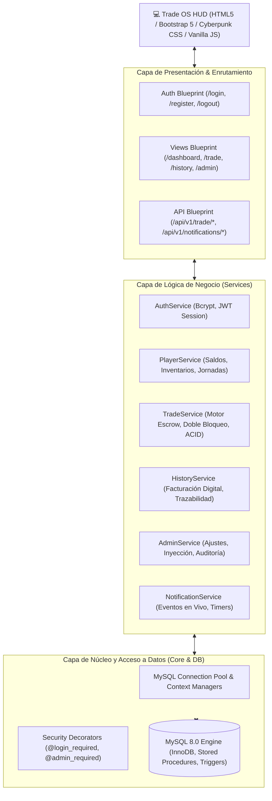
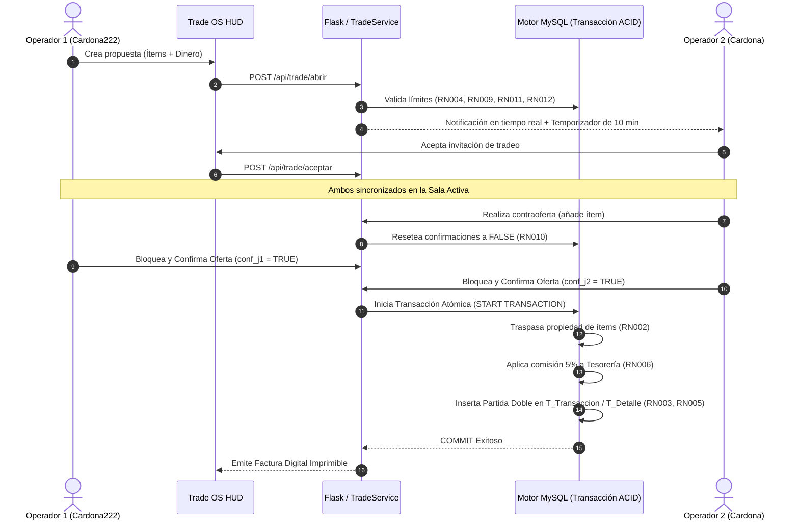

# 🎮 ECONOMY RP — Trade OS Gaming HUD & Engine Transaccional P2P

[](https://www.python.org/)
[](https://flask.palletsprojects.com/)
[](https://www.mysql.com/)
[](https://pypi.org/project/bcrypt/)
[]()

> **Institución Universitaria Pascual Bravo**  
> **Asignatura:** Ingeniería de Software I / Bases de Datos I  
> **Asesor:** Juan Camilo Palacio Alcaraz  
> **Equipo de Trabajo (Grupo 4):**
> - **Miguel Ángel Cardona Agudelo**
> - **Luisa María López Orrego**
> - **Jorge Luis Ordoñez Ávila**  
> **Versión:** 2.0.0 (Release Candidate - Architecture Overhaul & Trade OS HUD)

---

## 📌 Tabla de Contenidos

- [1. Descripción General](#1-descripción-general)
- [2. Arquitectura de Software & Patrones](#2-arquitectura-de-software--patrones)
- [3. Matriz de Cumplimiento de Reglas de Negocio (RN001 - RN012)](#3-matriz-de-cumplimiento-de-reglas-de-negocio-rn001---rn012)
- [4. Flujo Transaccional & Motor Escrow](#4-flujo-transaccional--motor-escrow)
- [5. Características de la Interfaz (Trade OS HUD)](#5-características-de-la-interfaz-trade-os-hud)
- [6. Panel de Administración & Monitoreo](#6-panel-de-administración--monitoreo)
- [7. Estructura del Proyecto](#7-estructura-del-proyecto)
- [8. Guía de Instalación y Despliegue](#8-guía-de-instalación-y-despliegue)
- [9. Credenciales de Prueba & Demostración](#9-credenciales-de-prueba--demostración)
- [10. Manual de Usuario y Evidencias](#10-manual-de-usuario-y-evidencias)

---

## 1. Descripción General

**Economy RP** es un sistema transaccional centralizado y seguro de alto rendimiento diseñado para comunidades de rol (GTA / FiveM / RedM / Discord RP). Reemplaza la dispersión de scripts aislados y vulnerables por un motor backend robusto con **garantía transaccional ACID**, eliminando de raíz:

- ❌ **Duplicación de ítems (*item dupe*):** Bloqueo y verificación de pertenencia en un único hilo transaccional.
- ❌ **Fraude por desconexión (*combat logging / trade cancel*):** Mecanismo *Escrow* con expiración controlada por temporizador.
- ❌ **Hiperinflación descontrolada:** *Money Sink* automático mediante retención de comisión (5%) acreditada a la Tesorería del Sistema.
- ❌ **Falta de auditoría:** Contabilidad por **Partida Doble** con tablas inmutables (`T_Transaccion`, `T_Detalle_Transaccion`) protegidas por triggers a nivel de base de datos.

---

## 2. Arquitectura de Software & Patrones

El proyecto sigue una arquitectura modular en capas desacopladas, facilitando la escalabilidad, mantenibilidad y cobertura de pruebas:



### Patrones Aplicados:
1. **Application Factory Pattern:** Inicialización dinámica y desacoplada de la app Flask (`app.py`).
2. **Modular Blueprints:** Separación de responsabilidades en rutas web y endpoints REST (`routes/`).
3. **Service Layer Architecture:** Aislamiento total de las reglas de negocio respecto a la capa HTTP (`services/`).
4. **Context Management & RAII:** Manejo seguro de conexiones y cursores con commit/rollback garantizado (`core/database.py`).
5. **Facade / Backward Compatibility:** Módulo `database.py` que centraliza exportaciones para compatibilidad de scripts.

---

## 3. Matriz de Cumplimiento de Reglas de Negocio (RN001 - RN012)

Todas las reglas exigidas por el modelo de negocio han sido implementadas y certificadas mediante validaciones en backend y base de datos:

| Código | Regla de Negocio | Condición Lógica / Algoritmo | Componente Responsable | Estado |
|---|---|---|---|:---:|
| **RN001** | **Registro Único Laboral** | $\text{Ganancia} = \text{Tarifa\_base} \times \text{Horas}$ | `sp_pagar_jornada`, `T_Jornada_Laboral` | ✅ Cumplido |
| **RN002** | **Propiedad Única y Exclusiva** | $(\text{Propietario}) = 1 \text{ por } \text{id\_item}$ | `T_Item`, `trade_service.finalizar_tradeo` | ✅ Cumplido |
| **RN003** | **Inmutabilidad del Historial** | Triggers `NO UPDATE` / `NO DELETE` (Append-Only) | `T_Transaccion`, `T_Detalle_Transaccion` | ✅ Cumplido |
| **RN004** | **Restricción por Deuda o Embargo** | $\text{tiene\_deuda} = 0 \land \text{restriccion} = \text{'Ninguna'}$ | `trade_service.abrir_negociacion`, `finalizar_tradeo` | ✅ Cumplido |
| **RN005** | **Trazabilidad de Emisión** | $\text{Origen} = \text{Cuenta\_Sistema (ID: 1)}$ | `sp_pagar_jornada`, `T_Detalle_Transaccion` | ✅ Cumplido |
| **RN006** | **Comisión por Transferencia** | $\text{Comisión} = \text{Monto} \times 5\% \to \text{Sistema}$ | `trade_service.finalizar_tradeo` | ✅ Cumplido |
| **RN007** | **Límite Máximo de Propiedades** | $\text{Cant\_Bienes}(\text{Jugador}) \le 100$ | `T_Servidor`, `trade_service.abrir_negociacion` | ✅ Cumplido |
| **RN008** | **Enfriamiento Laboral (Cooldown)** | $\Delta t \ge 15 \text{ minutos}$ | `sp_pagar_jornada`, `trg_jornada_enfriamiento` | ✅ Cumplido |
| **RN009** | **Penalización por Bancarrota** | $\text{Saldo} \ge \text{Monto} \land \text{Estado} \ne \text{'BANCARROTA'}$ | `trade_service.abrir_negociacion`, `T_Cuenta` | ✅ Cumplido |
| **RN010** | **Doble Confirmación con Reset** | Modificación $\implies (\text{conf\_j1}=\text{false}, \text{conf\_j2}=\text{false})$ | `trade_service.actualizar_oferta_jugador` | ✅ Cumplido |
| **RN011** | **Límite Diario de Tradeos** | $\text{Tradeos\_Hoy}(\text{Jugador}) \le 5$ | `trade_service.abrir_negociacion` | ✅ Cumplido |
| **RN012** | **Tradeo Único Simultáneo** | $\text{Mesa\_Activa}(\text{Jugador}) \le 1$ | `trade_service.abrir_negociacion`, `consultar_mesa_activa` | ✅ Cumplido |

---

## 4. Flujo Transaccional & Motor Escrow



---

## 5. Características de la Interfaz (Trade OS HUD)

- 🌌 **Diseño Cyberpunk / Tactical HUD:** Paleta oscura premium con efectos Glassmorphism, neón cian/magenta y tipografías tecno-militares (`Orbitron` & `Rajdhani`).
- 🧭 **Barra Lateral Colapsable (Dock Mode):** Optimización para pantallas anchas y portátiles, con navegación fluida y persistencia de estado.
- 💎 **Marcos Holográficos por Rareza:** Identificación visual instantánea de ítems (`Legendario`, `Épico`, `Raro`, `Común`).
- ⏱️ **Temporizadores en Vivo:** Cuenta regresiva en invitaciones de tradeo y alertas de expiración automática.
- 🔔 **Sistema de Notificaciones Global:** Banner animado y toasts interactivos para respuestas a invitaciones y cambios de oferta.
- 🧾 **Facturación Digital Táctica:** Modal de factura detallada con número fiscal, desglose de partida doble, comisión de tesorería y botón de impresión directa.

---

## 6. Panel de Administración & Monitoreo

Acceso exclusivo para roles de alta jerarquía (`ADMIN` / `SUPERADMIN`) con herramientas de supervisión económica:
- **Resumen Financiero Global:** Métrica de dinero total en circulación, recaudación de tesorería y volumen de transacciones.
- **Inspector de Inventarios en Vivo:** Búsqueda en tiempo real de cualquier jugador e inspección de sus propiedades.
- **Inyector de Ítems / Bienes:** Asignación directa de propiedades con nivel de rareza configurable.
- **Ajuste y Sanción de Cuentas:** Modificación de saldos, restablecimiento de cooldown laboral y aplicación de embargos/deudas.

---

## 7. Estructura del Proyecto

```
economy_rp/
├── core/                           # Núcleo del backend
│   ├── __init__.py
│   ├── config.py                   # Configuración centralizada de entorno
│   ├── database.py                 # Conexión, cursores y context managers
│   └── decorators.py               # Decoradores de autenticación y roles
├── routes/                         # Capa de presentación (Blueprints)
│   ├── __init__.py
│   ├── auth_routes.py              # Rutas de autenticación (Login, Register, Logout)
│   ├── view_routes.py              # Vistas HTML (Dashboard, Trade, History, Admin)
│   └── api_routes.py               # Endpoints REST y AJAX
├── services/                       # Capa de lógica de negocio (Servicios)
│   ├── __init__.py
│   ├── auth_service.py             # Lógica de seguridad y contraseñas bcrypt
│   ├── player_service.py           # Gestión de saldos, inventarios y jornadas
│   ├── trade_service.py            # Motor transaccional de intercambio y escrow
│   ├── history_service.py          # Consultas históricas y facturas
│   ├── admin_service.py            # Gestión administrativa y auditoría
│   └── notification_service.py     # Servicio de alertas y notificaciones en vivo
├── sql/                            # Scripts y definiciones de base de datos
│   ├── schema.sql                  # Estructura DDL, procedimientos y triggers
│   └── add_multi_item_support.sql  # Extensiones para negociación multi-ítem
├── static/                         # Recursos estáticos
│   ├── css/
│   │   ├── style.css               # Estilos globales y HUD Cyberpunk
│   │   └── login.css               # Estilos de la pantalla de login táctica
│   ├── js/
│   │   └── main.js                 # Lógica interactiva cliente, timers y modales
│   ├── img/                        # Fondos cinematográficos y logos
│   └── evidence/                   # Capturas oficiales de validación y pruebas
├── templates/                      # Plantillas HTML con Jinja2
│   ├── base.html                   # Layout maestro con Dock Sidebar
│   ├── login.html                  # Acceso de usuarios
│   ├── register.html               # Registro de operadores
│   ├── dashboard.html              # Panel principal del jugador
│   ├── trade.html                  # Sala de negociación táctica
│   ├── history.html                # Historial de transacciones y facturación
│   └── admin.html                  # Command Center administrativo
├── scripts/                        # Scripts de soporte y generación de reportes
│   └── generate_pdf_report.py      # Generador de manual y evidencias en PDF
├── MANUAL_DE_USUARIO_Y_EVIDENCIAS_ECONOMY_RP.pdf # Documento PDF oficial
├── MANUAL_USUARIO_Y_EVIDENCIAS.md  # Manual detallado paso a paso en Markdown
├── reglas_funcionales.md           # Especificación formal de reglas RN001-RN012
├── requeriments.pdf                # Requerimientos académicos originales
├── requirements.txt                # Dependencias de Python
├── .env.example                    # Plantilla de variables de entorno
├── database.py                     # Fachada de compatibilidad hacia atrás
├── app.py                          # Fábrica de la aplicación Flask
└── run.py                          # Punto de entrada principal
```

---

## 8. Guía de Instalación y Despliegue

### Requisitos Previos:
- **Python 3.10** o superior.
- **MySQL Server 8.0** o superior.
- **Git**.

### Paso 1: Clonar el Repositorio
```bash
git clone https://github.com/Cardona-vk/Economia_rp.git
cd Economia_rp
```

### Paso 2: Crear Entorno Virtual e Instalar Dependencias
```bash
python -m venv venv
# En Windows:
.\venv\Scripts\activate
# En Linux / macOS:
source venv/bin/activate

pip install -r requirements.txt
```

### Paso 3: Configurar Variables de Entorno
Copia la plantilla `.env.example` a un archivo `.env` y ajusta las credenciales de tu base de datos:
```ini
DB_HOST=localhost
DB_USER=root
DB_PASSWORD=tu_contraseña_aqui
DB_NAME=economy_rp
DB_PORT=3306

SECRET_KEY=clave_secreta_super_segura
FLASK_DEBUG=True
PORT=5000
```

### Paso 4: Inicializar la Base de Datos
Importa el esquema relacional con todos los procedimientos almacenados y triggers:
```bash
mysql -u root -p economy_rp < sql/schema.sql
```

### Paso 5: Ejecutar el Servidor
```bash
python run.py
```
Accede en tu navegador a: **`http://localhost:5000`**

---

## 9. Credenciales de Prueba & Demostración

Para realizar pruebas completas de intercambio bilateral y administración:

| Rol | Usuario | Contraseña | ID de Jugador |
|---|---|---|:---:|
| **Operador / Jugador 1** | `Cardona222` | `21492477` | `1` |
| **Operador / Jugador 2** | `Cardona` | `21492477` | `2` |
| **Administrador** | `Cardona222` *(o usuario con rol ADMIN)* | `21492477` | `1` |

---

## 10. Manual de Usuario y Evidencias

Para consultar la guía visual paso a paso con capturas de pantalla de alta resolución y justificación técnica completa:
- 📄 **Documento Markdown:** [MANUAL_USUARIO_Y_EVIDENCIAS.md](MANUAL_USUARIO_Y_EVIDENCIAS.md)
- 📑 **Reporte Ejecutivo en PDF:** [MANUAL_DE_USUARIO_Y_EVIDENCIAS_ECONOMY_RP.pdf](MANUAL_DE_USUARIO_Y_EVIDENCIAS_ECONOMY_RP.pdf)
- 📋 **Especificación de Reglas de Negocio:** [reglas_funcionales.md](reglas_funcionales.md)

---

> 💡 *Desarrollado con rigor de ingeniería de software para simulación económica y de comercio en entornos de rol.*
